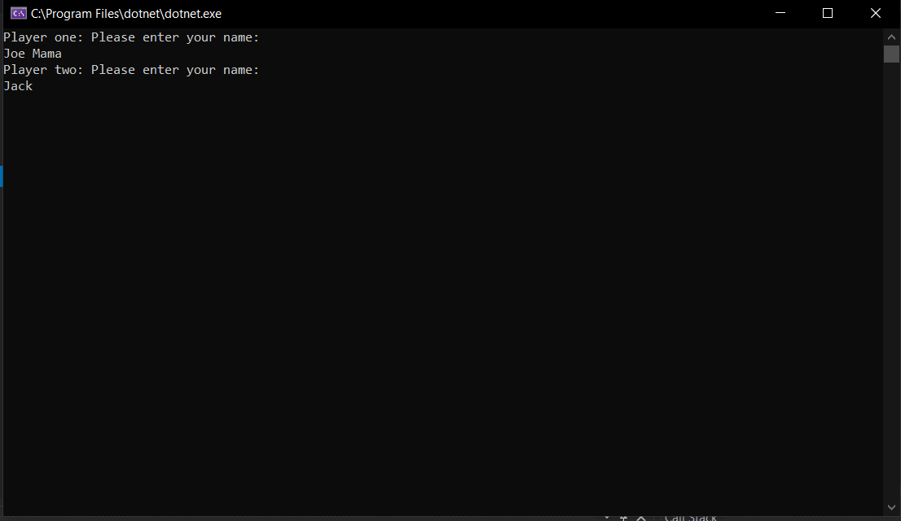
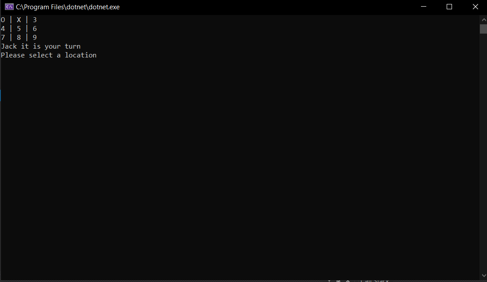
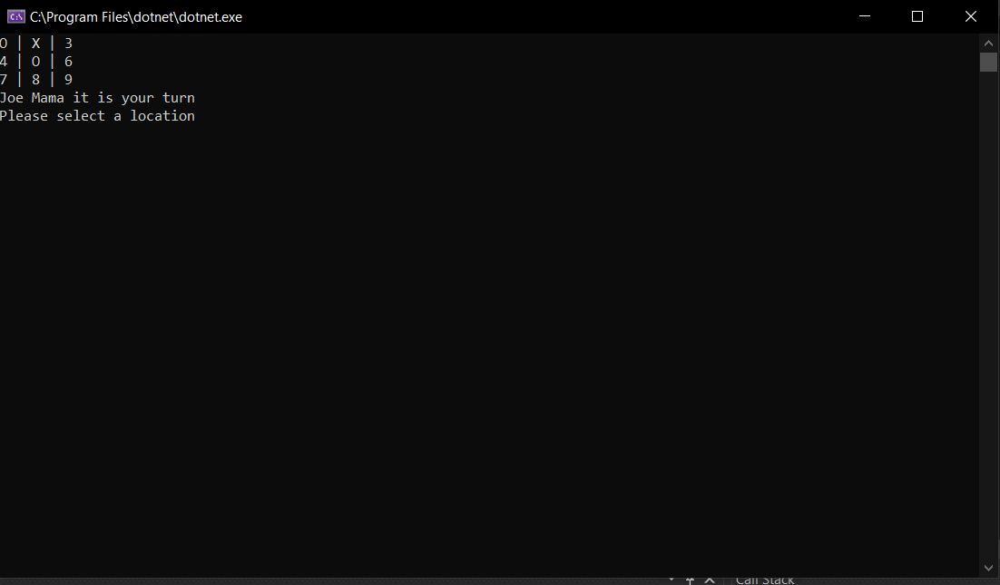
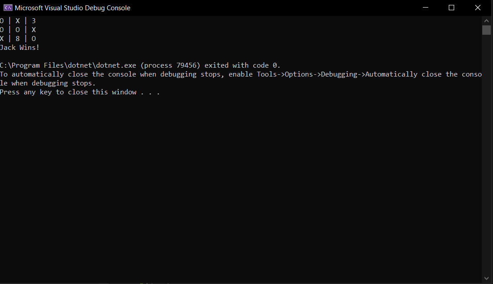
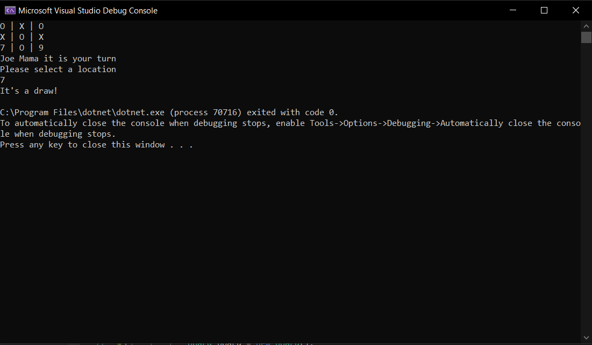

# Tic-Tac-Toe Game

Lab04-Classes-Objects

*Author: Michael Refvem, Lami Beach, Lesley Rivera*

----

## Description
This is a C# console application that is a two (2) person, turn based Tic-Tac-Toe program.

---

### Getting Started
Clone this repository to your local machine.

```
$ git clone https://github.com/MRefvem/Lab04-Classes-Objects-Tic-Tac-Toe
```

### To run the program from Visual Studio:
Select ```File``` -> ```Open``` -> ```Project/Solution```

Next navigate to the location you cloned the Repository.

Double click on the ```Lab04-Classes-Objects-Tic-Tac-Toe```

Then select and open ```StarterCode.sln```

---

### Visuals

#### Application Start

1. PROMPT THE USERS TO ENTER THEIR NAMES




#### Using the Application

2. HAVE THE USERS SWITCH OFF BY TAKING TURNS







#### Application End

3. DECLARE A WINNER




4. OR DECLARE A DRAW





---

### Change Log 
1.2: *Resubmit - all feature tasks complete, unit tests working* - 18 Jul 2020  
1.1: *initial commit* - 8 Jul 2020  

